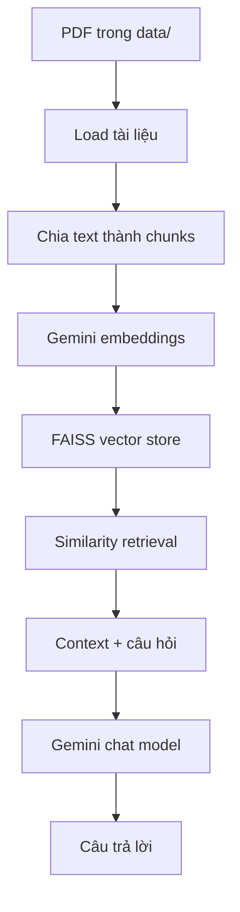

# RAG Pipeline & LLM API Practice

Repository ghi lại quá trình thực hành xây dựng **Retrieval-Augmented
Generation (RAG)** và gọi các mô hình ngôn ngữ qua nhiều kiểu giao tiếp khác
nhau: Gemini API, Ollama và OpenAI-compatible API của LM Studio.

Mục tiêu chính của repository là hiểu từng thành phần của một ứng dụng LLM
thay vì xây dựng một hệ thống production hoàn chỉnh. Các script được giữ ngắn
gọn để thuận tiện quan sát request, response và luồng dữ liệu.

## Nội dung chính

- Xây dựng RAG pipeline trên tài liệu PDF bằng LangChain.
- Tạo embedding bằng Gemini API.
- Lưu và tìm kiếm vector bằng FAISS trên máy local.
- Gọi cloud model thông qua API key.
- Gọi local model qua Ollama.
- Gọi local model qua OpenAI-compatible API của LM Studio.

## RAG pipeline

[`rag_pipeline.py`](./rag_pipeline.py) là phần thực hành chính của repository.



Pipeline hiện tại thực hiện lần lượt:

1. Đọc tất cả file PDF bên trong thư mục `./data`.
2. Chia nội dung thành các đoạn nhỏ bằng
   `RecursiveCharacterTextSplitter`.
3. Gọi Gemini embedding model để biến mỗi đoạn văn thành vector.
4. Tạo FAISS vector store trong bộ nhớ.
5. Truy xuất các đoạn gần nhất với câu hỏi.
6. Đưa context tìm được và câu hỏi vào prompt.
7. Gọi Gemini chat model và in câu trả lời.

Prompt yêu cầu mô hình chỉ trả lời dựa trên context được cung cấp. Nếu context
không chứa đủ thông tin, mô hình được yêu cầu trả lời rằng không biết dựa trên
ngữ cảnh hiện có. Đây là cách thử nghiệm đơn giản nhằm hạn chế việc mô hình tự
suy đoán ngoài tài liệu.

### Cấu hình RAG hiện tại

| Thành phần | Giá trị |
|---|---:|
| Chunk size | `1200` ký tự |
| Chunk overlap | `200` ký tự |
| Số kết quả truy xuất | `k = 5` |
| Similarity score threshold | `0.3` |
| Embedding model | `gemini-embedding-2-preview` |
| Chat model | `gemini-3.7-flash` |
| Temperature | `0` |
| Vector store | FAISS in-memory |

Các model ID trên phản ánh cấu hình trong code tại thời điểm hiện tại. Nếu
model không khả dụng với tài khoản hoặc phiên bản SDK đang dùng, hãy thay bằng
model được Gemini API hỗ trợ.

## Các bài thực hành API

| File | Nội dung thực hành | Backend |
|---|---|---|
| [`embed_api.py`](./embed_api.py) | Gửi một đoạn text và in embedding trả về | Gemini API |
| [`rag_pipeline.py`](./rag_pipeline.py) | Xây dựng RAG hoàn chỉnh trên PDF | Gemini API + FAISS |
| [`ollama_chat.py`](./ollama_chat.py) | Gọi mô hình `qwen3.5:2b` trên máy local | Ollama |
| [`lmstudio.py`](./lmstudio.py) | Gửi chat completion qua chuẩn OpenAI | LM Studio local server |

Ba cách gọi model giúp quan sát sự khác nhau giữa:

- **Cloud API:** cần API key, model chạy trên hạ tầng của nhà cung cấp.
- **Local client:** Python giao tiếp trực tiếp với Ollama đang chạy trên máy.
- **OpenAI-compatible API:** dùng OpenAI SDK nhưng đổi `base_url` sang server
  của LM Studio.

## Cấu trúc repository

```text
Rag_pipeline_and_api_call/
├── data/                 # Thư mục PDF do người dùng tự thêm
├── embed_api.py          # Thực hành Gemini Embedding API
├── lmstudio.py           # Thực hành OpenAI-compatible API
├── ollama_chat.py        # Thực hành gọi local model bằng Ollama
├── rag_pipeline.py       # Pipeline RAG chính
└── README.md
```

## Yêu cầu

- Python 3.10 trở lên.
- Gemini API key cho `embed_api.py` và `rag_pipeline.py`.
- Ollama đã được cài đặt và chạy cho `ollama_chat.py`.
- LM Studio đã load model và bật local server cho `lmstudio.py`.

Mỗi script là một thử nghiệm độc lập. Bạn không cần chạy Ollama hoặc LM
Studio nếu chỉ thực hành Gemini/RAG.

## Cài đặt

Clone repository và tạo virtual environment:

```bash
git clone https://github.com/taitv004/Rag_pipeline_and_api_call.git
cd Rag_pipeline_and_api_call

python3 -m venv .venv
source .venv/bin/activate
python -m pip install --upgrade pip
```

Cài toàn bộ package được các script hiện tại import:

```bash
pip install \
  google-genai \
  python-dotenv \
  ollama \
  openai \
  langchain-community \
  langchain-text-splitters \
  langchain-google-genai \
  langchain-openai \
  faiss-cpu \
  "unstructured[pdf]"
```

Nếu chỉ muốn chạy một bài thực hành, có thể cài nhóm package nhỏ hơn thay vì
cài toàn bộ.

## Cấu hình Gemini API key

Tạo file `.env` ở thư mục gốc:

```env
GEMINI_API_KEY=your_api_key_here
```

Không ghi API key trực tiếp vào code và không commit `.env` lên GitHub. Nên
thêm tối thiểu các mục sau vào `.gitignore`:

```gitignore
.env
.venv/
__pycache__/
data/
```

`data/` được bỏ qua trong gợi ý trên vì tài liệu dùng cho RAG có thể là dữ
liệu riêng tư. Nếu muốn cung cấp PDF mẫu công khai trong repository, có thể
bỏ dòng này.

## Cách chạy

### 1. Thử Gemini Embedding API

[`embed_api.py`](./embed_api.py) gửi một câu tiếng Việt đến
`gemini-embedding-2` và in embedding đầu tiên:

```bash
python embed_api.py
```

Kết quả là một vector số biểu diễn ý nghĩa ngữ nghĩa của input. Các văn bản
có nội dung gần nhau thường có vector gần nhau trong không gian embedding.

Tài liệu tham khảo:
[Gemini Embeddings](https://ai.google.dev/gemini-api/docs/embeddings).

### 2. Chạy RAG trên PDF

Tạo thư mục dữ liệu và đặt một hoặc nhiều file PDF vào đó:

```bash
mkdir -p data
```

```text
data/
├── document_01.pdf
└── document_02.pdf
```

Chạy pipeline:

```bash
python rag_pipeline.py
```

Nhập câu hỏi khi terminal hiển thị:

```text
Question: Tài liệu nói gì về ...?
```

Mỗi lần chạy, script đọc lại PDF, tạo lại embedding và dựng FAISS index mới.
Vector store hiện chưa được lưu xuống ổ đĩa.

### 3. Gọi local model bằng Ollama

Cài Ollama, khởi động dịch vụ và tải model được script sử dụng:

```bash
ollama pull qwen3.5:2b
```

Sau đó chạy:

```bash
python ollama_chat.py
```

Lưu ý: code hiện tại lặp qua response theo kiểu streaming nhưng chưa truyền
`stream=True` vào hàm `chat`. Để nhận từng chunk đúng như ý đồ của vòng lặp,
cập nhật lời gọi thành:

```python
response = chat(
    model="qwen3.5:2b",
    messages=[...],
    stream=True,
)
```

Nếu không muốn streaming, bỏ vòng lặp và in trực tiếp
`response["message"]["content"]`.

Tài liệu tham khảo:
[Ollama streaming](https://docs.ollama.com/capabilities/streaming).

### 4. Gọi model qua LM Studio

Trong LM Studio:

1. Tải và load một model chat.
2. Bật local API server.
3. Kiểm tra server đang nghe tại `http://127.0.0.1:1234`.
4. Thay `local-model` trong `lmstudio.py` bằng model identifier mà server
   cung cấp nếu cần.

Chạy script:

```bash
python lmstudio.py
```

Script dùng OpenAI Python client với cấu hình:

```python
client = OpenAI(
    api_key="lm-studio",
    base_url="http://127.0.0.1:1234/v1",
)
```

Request có hình thức giống OpenAI Chat Completions nhưng được gửi đến model
đang chạy hoàn toàn trên máy local.

Tài liệu tham khảo:
[LM Studio OpenAI-compatible endpoints](https://lmstudio.ai/docs/developer/openai-compat).

## Những gì có thể quan sát từ RAG pipeline

- Chunk quá lớn có thể chứa nhiều thông tin thừa; chunk quá nhỏ có thể làm
  mất ngữ cảnh.
- Chunk overlap giúp giữ thông tin nằm ở ranh giới giữa hai đoạn.
- Embedding quyết định cách tài liệu và câu hỏi được biểu diễn để tìm kiếm.
- `k` và score threshold ảnh hưởng trực tiếp đến context đưa vào LLM.
- Retrieval tốt không bảo đảm generation đúng, nhưng retrieval sai thường
  khiến câu trả lời thiếu hoặc không liên quan.
- Prompt có thể giới hạn hành vi của LLM nhưng không thay thế việc đánh giá
  chất lượng retrieval và câu trả lời.

## Giới hạn hiện tại

Repository đang ở mức thực hành và chưa hướng tới production:

- FAISS index được tạo lại sau mỗi lần chạy.
- Pipeline chỉ nhận một câu hỏi trong mỗi process.
- Chưa có conversation history hoặc memory.
- Chưa có hybrid search, reranking hoặc query transformation.
- Chưa có bộ câu hỏi và ground truth để đo retrieval/generation quality.
- Citation phụ thuộc vào metadata do PDF loader tạo ra và chưa được kiểm tra
  bắt buộc.
- Chưa có xử lý lỗi API, retry, logging hoặc quản lý chi phí/token.
- Chưa đóng gói pipeline thành REST API hay giao diện người dùng.

## Hướng mở rộng

- Thêm `requirements.txt` và `.env.example`.
- Lưu/load FAISS index thay vì embedding lại toàn bộ PDF.
- Tách ingestion và query thành hai chương trình độc lập.
- Hiển thị source, page và retrieval score cho từng đoạn được lấy về.
- So sánh nhiều chiến lược chunking và embedding model.
- Thêm reranker và hybrid retrieval.
- Xây dựng bộ đánh giá cho retrieval recall, faithfulness và answer quality.
- Đóng gói RAG chain thành FastAPI endpoint hoặc giao diện chat.

## Lưu ý

Repository được tạo cho mục đích học tập và thử nghiệm. Không đưa tài liệu
nhạy cảm lên cloud API nếu chưa đánh giá yêu cầu bảo mật và chính sách dữ liệu
của dự án.
